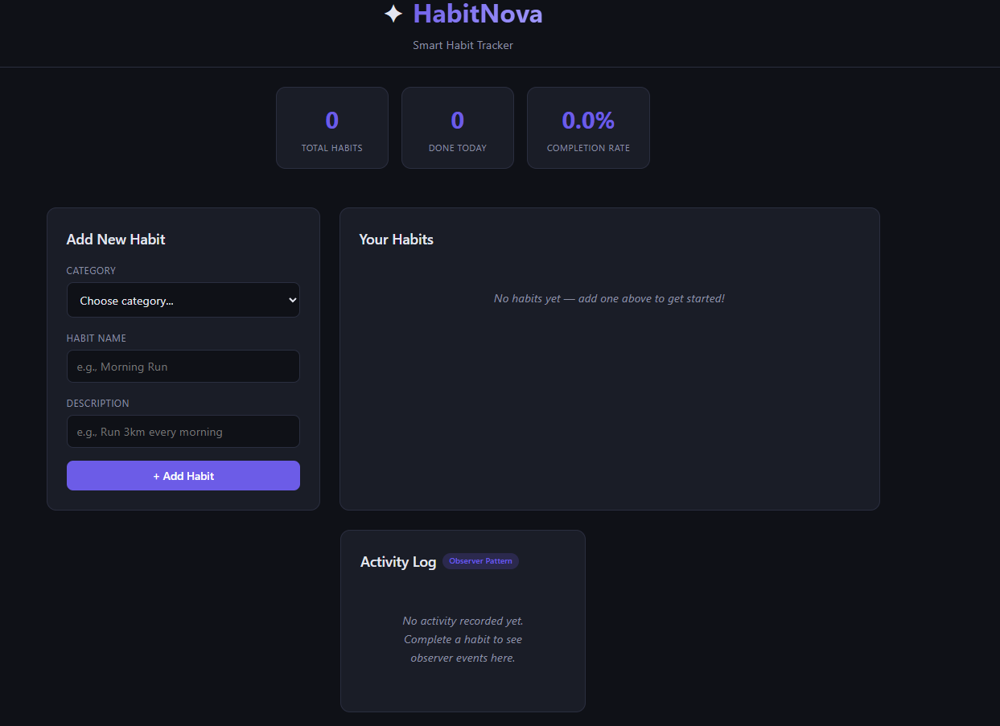
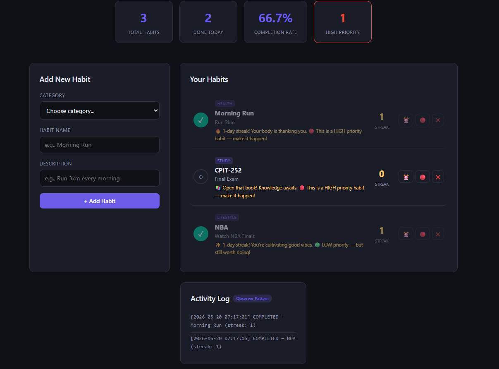

<div align="center">

# ✦ HabitNova

**A smart habit tracker that helps you build consistency — powered by design patterns.**


</div>

---

## What is HabitNova?

Most habit trackers are either too basic (plain checklists) or too complex (full productivity suites). HabitNova sits in the middle — a focused, intelligent tracker that lets you define habits across categories, track daily completion, monitor streaks and progress, and receive motivational feedback that adapts to your consistency.

Built as a CPIT-252 Software Design Patterns project, HabitNova demonstrates three GoF patterns working together in a real application: **Factory Method**, **Decorator**, and **Observer**.

---

## Features

- 🏗 Create habits across three categories — Health, Study, Lifestyle
- 🔥 Streak engine tracks current and all-time best streaks per habit
- ⏰ Add reminders to any habit at runtime (Decorator pattern)
- 🔴 Set priority levels (HIGH / MEDIUM / LOW) on any habit (Decorator pattern)
- 🔔 Milestone celebrations at 7, 30, and 100 day streaks (Observer pattern)
- ⚠️ Streak-break warnings with recovery encouragement (Observer pattern)
- 📋 Activity log captures all completion events in real time (Observer pattern)
- 💾 Data persists across restarts via H2 embedded database
- 🌐 Web dashboard with dark theme UI — works from any browser
- 🖥 Console mode also available for terminal usage
- 🐳 Dockerized — one command to build and run

---

## Tech Stack

| Layer | Technology |
|---|---|
| Language | Java 17 |
| Framework | Spring Boot 3.3.5 |
| Template Engine | Thymeleaf |
| Database | H2 (embedded, file-based) |
| ORM | Hibernate / Spring Data JPA |
| Frontend | HTML + CSS (dark theme) + Vanilla JS |
| Build Tool | Maven |
| Containerization | Docker + Docker Compose |
| Testing | JUnit 5 + Spring MockMvc + JaCoCo |

---

## Getting Started

### Requirements

- Java 17 or higher
- Maven 3.6 or higher

### Run the project

```bash
# 1. Clone the repository
git clone https://github.com/cpit252-spring-26-IT1/project-habitnova
cd project-habitnova

# 2. Build the project
mvn clean install

# 3. Run it
mvn spring-boot:run
```

Then open your browser and go to:

```
http://localhost:8080
```

### Run with Docker

```bash
docker compose up --build
```

The app starts at `http://localhost:8080`. Habit data is stored in a named Docker volume and survives container restarts.

### Run the test suite

```bash
mvn test
```

Coverage report is generated at `target/site/jacoco/index.html`.

---

## Project Structure

```
project-habitnova/
├── src/main/java/sa/edu/kau/fcit/cpit252/project/
│   ├── model/            # Habit class hierarchy (abstract Habit + 3 subclasses)
│   ├── factory/          # Factory Method pattern — HabitFactory
│   ├── decorator/        # Decorator pattern — Reminder & Priority wrappers
│   ├── observer/         # Observer pattern — Milestone, StreakBreak, CompletionLog
│   ├── entity/           # JPA entity for H2 database persistence
│   ├── repository/       # Spring Data JPA repository
│   ├── service/          # Business logic — orchestrates all patterns + DB
│   ├── controller/       # Web controller (Thymeleaf) + REST API controller
│   ├── dto/              # Request DTOs with Bean Validation
│   └── view/             # Console UI (legacy terminal mode)
├── src/main/resources/
│   ├── templates/        # Thymeleaf HTML dashboard
│   ├── static/           # CSS + JavaScript
│   └── application.properties
├── src/test/             # JUnit 5 test suite + JaCoCo coverage
├── Dockerfile            # Multi-stage Docker build
├── docker-compose.yml    # One-command container orchestration
└── pom.xml
```

---

## Design Patterns Used

| Stage | Category | Pattern | Description |
|:------|:---------|:--------|:------------|
| Stage 1 | Creational | **Factory Method** | `HabitFactory` creates `HealthHabit`, `StudyHabit`, or `LifestyleHabit` based on a category string — the caller never touches concrete classes |
| Stage 2 | Structural | **Decorator** | `ReminderDecorator` and `PriorityDecorator` wrap any habit to add reminder times or priority levels at runtime — stackable without subclass explosion |
| Stage 3 | Behavioral | **Observer** | `Habit` acts as the Subject; `MilestoneObserver`, `StreakBreakObserver`, and `CompletionLogObserver` react to completion events independently |

---

## Screenshots




---

## Team

| Name | Student ID |
|:-----|:----------:|
| Fahad Alshehri | 2338900 |
| Alwaleed Alrefaei | 2345441 |

**Course:** CPIT-252 Software Design Patterns — King Abdulaziz University

---


## Generative AI Disclosure

This project used generative AI tools in accordance with the CPIT-252 course policy on acceptable use. All AI-assisted work is cited below per the syllabus requirements.

| Tool | Date       | Prompt / Usage |
|:-----|:-----------|:---------------|
| Claude, Anthropic | 19/05/2026 | Improve the test coverage and increase it to more than 95%. |
| Claude, Anthropic | 18/05/2026 | Create the UI for the project. |


All code was reviewed, understood, and tested by ours. AI tools were used only for acceptable purposes as defined by the course policy (exploring topics, brainstorming, debugging, code refactoring, and proofreading).

---

## License

MIT — free to use, modify, and share. See the [LICENSE](LICENSE) file for details.

---

<div align="center">
  Made by <b>Fahad & Alwaleed</b> at King Abdulaziz University
</div>
